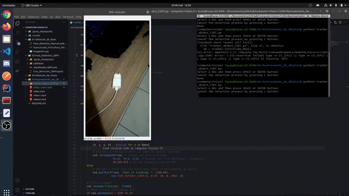

### 04 - Rastreamento de objetos.
    - O rastreamento é realizado usando o algoritmo CSRT.
    - Feito em python.
    - OpenCV

Neste projeto é feito o rastreamento de um objeto ao decorrer do vídeo. O objeto é selecionado a partir do primeiro frame de vídeo e então rastreado até que deixe a área de captura ou o vídeo termine.

