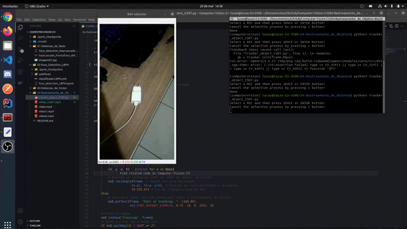

# Computer-Vision-CV
Repositório sobre visão computacional, em construção...

### 01 - Detecção de faces usando o algoritmo Haarcascade.
    - Neste projeto é realizado a detecção de face utilizando o Haarcascade, um algoritmo bastante 
      conhecido na tarefa de detecção.
    - Feito em python no Jupyter Notebook.
    - OpenCV
    
### 02 - Detecção de faces usando o algoritmo LBPH.
    - Detecção de faces atravez do LBPH, o algorimo baseado em histogramas. 
    - Feito em python no Jupyter Notebook..
    - OpenCV

### 03 - Rastreamento de objetos.
    - Detecção de corpo utilizando Haarcascade.
    - Feito em python.
    - OpenCV

### 04 - Rastreamento de objetos.
Neste projeto é feito o rastreamento de um objeto ao decorrer do vídeo. O objeto é selecionado a partir do primeiro frame de vídeo e então rastreado até que deixe a área de captura ou o vídeo termine.

    - Python.
    - OpenCV
    - CSRT, Rastreador.

